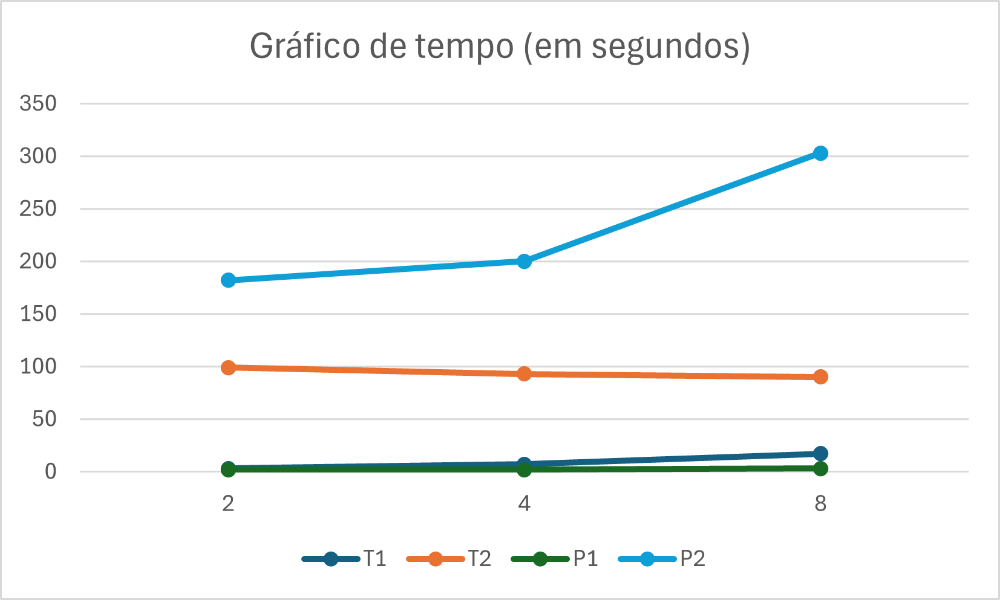
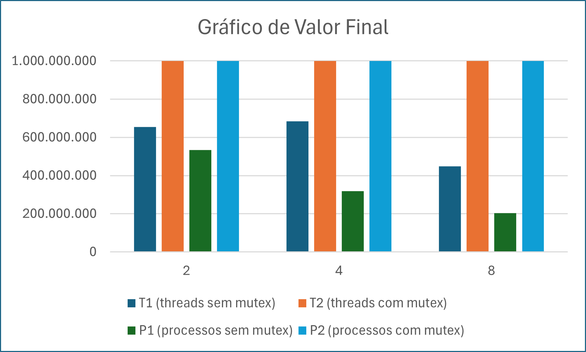

# Trabalho 1 — Sistemas Operacionais – 2026/1

## O Duelo de Contextos — Processos vs. Threads

## Integrantes

- Arthur Pinto Ferreira
- Matheus Corbellini Steindorff
- Rafaela do Nascimento Mello
- Vinicius Moço Quintian

---

## Introdução

Este trabalho compara o overhead de criação, o custo de comunicação e a consistência de dados entre processos (POSIX fork) e threads (POSIX pthreads) em ambiente Linux.

O experimento consiste em incrementar um contador global até 1.000.000.000 (um bilhão), distribuindo o trabalho entre N unidades de execução (N = 2, 4 e 8), em quatro cenários:

| Código | Descrição |
|--------|-----------|
| T1 | Threads sem mutex (sem sincronização) |
| T2 | Threads com pthread_mutex |
| P1 | Processos via fork + memória compartilhada (shmget) sem semáforo |
| P2 | Processos via fork + memória compartilhada com sem_open |

### Comandos

```bash
make                    # Compilar
lscpu                   # Assinatura do Hardware
./threads <N> 1         # Executar threads sem mutex (T1)
./threads <N> 2         # Executar threads com mutex (T2)
./processos <N> 1       # Executar processos sem semáforo (P1)
./processos <N> 2       # Executar processos com semáforo (P2)
make clean              # Limpar binários
```

---

## Desenvolvimento

### Assinatura do Hardware

```
Architecture:             x86_64
  CPU op-mode(s):         32-bit, 64-bit
  Address sizes:          39 bits physical, 48 bits virtual
  Byte Order:             Little Endian
CPU(s):                   8
  On-line CPU(s) list:    0-7
Vendor ID:                GenuineIntel
  Model name:             Intel(R) Core(TM) i3-N305
    CPU family:           6
    Model:                190
    Thread(s) per core:   1
    Core(s) per socket:   8
    Socket(s):            1
    Stepping:             0
    BogoMIPS:             3609.61
    Flags:                fpu vme de pse tsc msr pae mce cx8 apic sep mtrr pge mca cmov pat pse36 clflush mmx fxsr sse sse2
                          ss ht syscall nx pdpe1gb rdtscp lm constant_tsc arch_perfmon rep_good nopl xtopology tsc_reliable
                          nonstop_tsc cpuid pni pclmulqdq vmx ssse3 fma cx16 pdcm pcid sse4_1 sse4_2 x2apic movbe popcnt
                          tsc_deadline_timer aes xsave avx f16c rdrand hypervisor lahf_lm abm 3dnowprefetch invpcid_single
                          ssbd ibrs ibpb stibp ibrs_enhanced tpr_shadow vnmi ept vpid ept_ad fsgsbase tsc_adjust bmi1 avx2
                          smep bmi2 erms invpcid rdseed adx smap clflushopt clwb sha_ni xsaveopt xsavec xgetbv1 xsaves avx_
                          vnni umip waitpkg gfni vaes vpclmulqdq rdpid movdiri movdir64b fsrm md_clear serialize arch_lbr f
                          lush_l1d arch_capabilities
Virtualization features:
  Virtualization:         VT-x
  Hypervisor vendor:      Microsoft
  Virtualization type:    full
Caches (sum of all):
  L1d:                    256 KiB (8 instances)
  L1i:                    512 KiB (8 instances)
  L2:                     16 MiB (8 instances)
  L3:                     6 MiB (1 instance)
```

O processador utilizado é um Intel Core i3-N305 com 8 núcleos físicos e 1 thread por núcleo (sem Hyper-Threading). Isso significa que os experimentos com N = 8 podem saturar todos os núcleos disponíveis, o que impacta diretamente no comportamento de concorrência e na frequência de colisões observadas nos experimentos sem sincronização.

---

### Resultados

#### Tabela Completa (Tempo + Valor Final)

| Experimento                 | N  | Tempo (s)   | Valor Final   |
|-----------------------------|----|-------------|---------------|
| T1 — threads sem mutex      | 2  | 3.3047 s    | 654.290.134   |
| T1 — threads sem mutex      | 4  | 7.5468 s    | 684.678.724   |
| T1 — threads sem mutex      | 8  | 17.6189 s   | 447.515.488   |
| T2 — threads com mutex      | 2  | 99.6028 s   | 1.000.000.000 |
| T2 — threads com mutex      | 4  | 93.5196 s   | 1.000.000.000 |
| T2 — threads com mutex      | 8  | 90.7124 s   | 1.000.000.000 |
| P1 — processos sem semáforo | 2  | 2.5497 s    | 533.402.362   |
| P1 — processos sem semáforo | 4  | 2.8438 s    | 319.062.540   |
| P1 — processos sem semáforo | 8  | 3.1545 s    | 203.808.717   |
| P2 — processos com semáforo | 2  | 182.4934 s  | 1.000.000.000 |
| P2 — processos com semáforo | 4  | 200.6238 s  | 1.000.000.000 |
| P2 — processos com semáforo | 8  | 303.9470 s  | 1.000.000.000 |

#### Tabela de Valores Finais

| Experimento                 | N = 2         | N = 4         | N = 8         |
|-----------------------------|---------------|---------------|---------------|
| T1 — threads sem mutex      | 654.290.134   | 684.678.724   | 447.515.488   |
| T2 — threads com mutex      | 1.000.000.000 | 1.000.000.000 | 1.000.000.000 |
| P1 — processos sem semáforo | 533.402.362   | 319.062.540   | 203.808.717   |
| P2 — processos com semáforo | 1.000.000.000 | 1.000.000.000 | 1.000.000.000 |

#### Valores com Corrupção (abaixo de 1 bilhão)

| Experimento                 | N = 2       | N = 4       | N = 8       |
|-----------------------------|-------------|-------------|-------------|
| T1 — threads sem mutex      | 654.290.134 | 684.678.724 | 447.515.488 |
| P1 — processos sem semáforo | 533.402.362 | 319.062.540 | 203.808.717 |

#### Tabela de Tempos

| Experimento                 | N = 2      | N = 4      | N = 8      |
|-----------------------------|------------|------------|------------|
| T1 — threads sem mutex      | 3.3047 s   | 7.5468 s   | 17.6189 s  |
| T2 — threads com mutex      | 99.6028 s  | 93.5196 s  | 90.7124 s  |
| P1 — processos sem semáforo | 2.5497 s   | 2.8438 s   | 3.1545 s   |
| P2 — processos com semáforo | 182.4934 s | 200.6238 s | 303.9470 s |

---

### Análise de Corrupção

Nos experimentos T1 (threads sem mutex) e P1 (processos sem semáforo), o contador não atingiu 1.000.000.000:

| Experimento      | N = 2       | N = 4       | N = 8       |
|------------------|-------------|-------------|-------------|
| T1 — valor final | 654.290.134 | 684.678.724 | 447.515.488 |
| P1 — valor final | 533.402.362 | 319.062.540 | 203.808.717 |

#### Por que o contador não chegou a 1 bilhão?

A operação contador++ não é atômica. Em nível de máquina ela se decompõe em três etapas de leitura do valor atual, incremento em registrador e escrita do resultado. Quando múltiplas unidades de execução realizam essas etapas simultaneamente sem sincronização, ocorre uma condição de corrida (race condition):

1. Unidade A lê contador = 1000.
2. Unidade B lê contador = 1000 (antes de A escrever).
3. A escreve contador = 1001.
4. B escreve contador = 1001 — o incremento de A foi sobrescrito e perdido.

Esse fenômeno é chamado de lost update (atualização perdida).

### Correlação com o hardware

O i3-N305 possui 8 núcleos independentes sem Hyper-Threading, o que significa que com N = 8 todos os núcleos executam genuinamente em paralelo, sem compartilhamento de pipeline. Isso maximiza as janelas de colisão entre as leituras e escritas concorrentes, explicando por que P1 com N = 8 (203.808.717) teve o pior índice de corrupção, quase 80% das incrementações foram perdidas. Cada núcleo possui seu próprio cache L1/L2 privado (256 KiB e 16 MiB por instância), o que agrava a inconsistência: cada núcleo pode ter uma cópia diferente do contador em seu cache antes de propagá-la para o L3 compartilhado.

---

### Gráfico de Escalabilidade

#### Gráfico 1 — Tempo de Execução vs. Número de Trabalhadores (N)



O gráfico de linhas mostra o tempo de execução (em segundos) para cada cenário conforme N varia entre 2, 4 e 8 trabalhadores.
Os cenários com sincronização (T2 e P2) dominam o eixo Y: P2 sobe de ~182 s (N=2) até ~304 s (N=8), pois cada incremento exige uma chamada de sistema de semáforo, que escala pessimamente com mais processos concorrendo pelo mesmo recurso. T2 apresenta comportamento levemente decrescente (~99 s → ~91 s), pois o mutex de thread tem overhead fixo mais baixo e a contenção se distribui melhor entre os núcleos.
Os cenários sem sincronização (T1 e P1) ficam próximos de zero na escala do gráfico: P1 mal ultrapassa 3 s mesmo em N=8, e T1 chega a ~18 s em N=8 — tempos baixos que resultam diretamente da corrupção de dados (menos incrementos efetivos sendo contabilizados).

#### Gráfico 2 — Valor Final do Contador vs. Número de Trabalhadores (N)



O gráfico de barras compara o valor final alcançado pelo contador em cada cenário e valor de N.
T2 e P2 (com sincronização) atingem consistentemente 1.000.000.000 em todos os valores de N, confirmando que os mecanismos de exclusão mútua garantem a integridade dos dados.
T1 e P1 (sem sincronização) apresentam valores muito abaixo de 1 bilhão, com degradação crescente conforme N aumenta: P1 cai de ~533 milhões (N=2) para apenas ~204 milhões (N=8), evidenciando que mais núcleos paralelos amplificam as colisões de leitura/escrita na memória compartilhada. T1 oscila entre ~447 e ~685 milhões, com comportamento menos previsível devido à forma como o escalonador distribui as threads entre os núcleos.

---

## Conclusão

### Overhead de Criação

Criar um processo via fork tem custo maior que criar uma thread: o sistema operacional precisa duplicar o espaço de endereçamento do processo pai (copy-on-write), alocar uma entrada na tabela de processos e configurar canais de IPC. Threads compartilham o mesmo espaço de endereçamento do processo criador, tornando sua criação significativamente mais leve.

Nos experimentos sem sincronização, P1 foi mais rápido que T1 em todos os cenários, o que pode parecer contraditório. Porém, isso se deve à menor corrupção de cache entre processos no início da execução, cada processo tem espaço próprio, e não indica menor overhead de criação.

### Comunicação

Threads compartilham memória automaticamente via variáveis globais. A comunicação é implícita e de baixo custo, mas exige sincronização explícita para evitar race conditions.

Processos precisam de mecanismos explícitos de IPC como memória compartilhada (shmget/shmat). Há custo adicional de configuração e de chamadas de sistema, além da necessidade de semáforos para proteger o acesso.

Threads são claramente mais eficientes na comunicação para dados compartilhados.

### Consistência de Dados

| Cenário | Resultado com N = 8 | Consistente? |
|---------|---------------------|--------------|
| T1      | 447.515.488         | Não          |
| T2      | 1.000.000.000       | Sim          |
| P1      | 203.808.717         | Não          |
| P2      | 1.000.000.000       | Sim          |

Sem mecanismos de sincronização (mutex ou semáforo), nenhum modelo garante consistência. Com sincronização, ambos atingem o resultado correto, porém com alto custo de tempo, especialmente P2 (semáforos POSIX nomeados têm overhead de chamada de sistema maior que mutexes de threads).

### Comparativo Final

| Aspecto                | Threads (pthreads)                       | Processos (fork)                          |
|------------------------|------------------------------------------|-------------------------------------------|
| Overhead de criação    | Baixo                                    | Alto                                      |
| Comunicação            | Eficiente (memória compartilhada nativa) | Custosa (IPC explícita via shmget)        |
| Consistência sem sinc. | Corrompida                               | Corrompida (mais severa com mais núcleos) |
| Consistência com sinc. | Sim (mutex) — 95 s                       | Sim (semáforo) — 180–304 s                |

Processos têm maior overhead de criação e de comunicação.
Threads são mais eficientes para tarefas que compartilham dados, desde que a sincronização seja aplicada corretamente.
